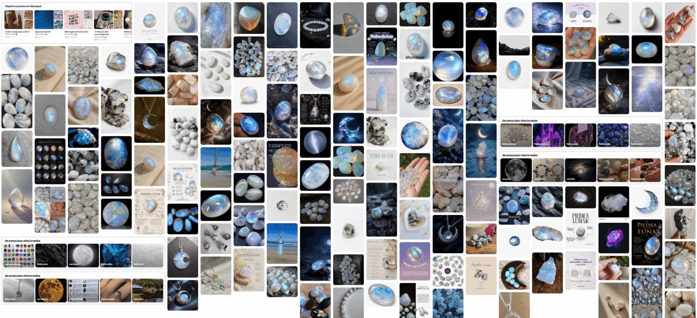
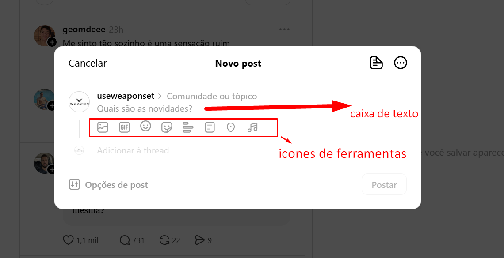

# Direção de UI e Design System — OPALIB

## 1. Objetivo

Definir a direção visual, a hierarquia das telas, os fundamentos do Design System e os componentes necessários para materializar a experiência aprovada do OPALIB.

Este documento governa:

- superfícies públicas e administrativas;
- arquitetura visual das telas;
- paleta;
- tipografia;
- espaçamento;
- formas;
- componentes;
- iconografia;
- movimento;
- estados;
- responsividade;
- acessibilidade visual.

Ele não define tecnologia, framework ou implementação.

## 2. Conceito visual

### Nome da direção

**Opala Lunar Editorial**

### Ideia central

O OPALIB deverá parecer uma biblioteca digital pessoal construída para leitura e descoberta, com uma identidade inspirada no brilho interno das pedras iridescentes.

A interface terá:

- fundo claro e levemente perolado;
- superfícies brancas;
- textos em azul-noturno;
- azul mineral como cor principal;
- reflexos lilás e areia como acentos;
- gradientes iridescentes usados com moderação;
- bastante espaço de respiração;
- tipografia editorial;
- bordas suaves;
- sombras discretas.

### Sensação desejada

A interface deverá transmitir:

- serenidade;
- curiosidade;
- profundidade;
- confiança;
- organização;
- descoberta;
- presença humana.

### O que evitar

- visual futurista excessivamente brilhante;
- gradientes em grandes áreas de leitura;
- excesso de transparência;
- efeito de vidro em todos os componentes;
- fundo completamente branco e clínico;
- cards envolvendo cada informação;
- sombras pesadas;
- aparência de dashboard corporativo;
- cores neon;
- feed semelhante a rede social;
- excesso de elementos decorativos relacionados a pedras.

## 3. Leitura do moodboard

Os principais sinais extraídos da referência são:

- branco leitoso e gelo como base;
- azul luminoso como manifestação principal da identidade;
- reflexos lilás, turquesa e dourado suave;
- contraste entre superfícies claras e fundos azul-noturno;
- formas orgânicas, arredondadas e imperfeitas;
- sensação de profundidade interna;
- brilho localizado, e não distribuído por toda a superfície;
- combinação entre delicadeza e solidez.

O moodboard deverá orientar atmosfera, cores e tratamento de superfícies. Fotografias de pedras não deverão ser repetidas indiscriminadamente na interface.

## 4. Paleta aprovada

### Cores fundamentais

| Token            |       Cor | Uso                                |
| ---------------- | --------: | ---------------------------------- |
| `background`     | `#F7F8F6` | Fundo principal perolado           |
| `surface`        | `#FFFFFF` | Conteúdo, formulários e navegação  |
| `surface-soft`   | `#EFF3F5` | Áreas secundárias                  |
| `surface-blue`   | `#EAF5FA` | Destaques suaves                   |
| `text-primary`   | `#172432` | Texto principal azul-noturno       |
| `text-secondary` | `#596673` | Metadados e textos auxiliares      |
| `text-subtle`    | `#7A858F` | Informações de menor hierarquia    |
| `border`         | `#D9E1E6` | Bordas e separadores               |
| `border-strong`  | `#B8C6CF` | Estados que exigem maior definição |

### Identidade

| Token           |       Cor | Uso                                  |
| --------------- | --------: | ------------------------------------ |
| `primary`       | `#326F8D` | Ações principais e links             |
| `primary-hover` | `#285B74` | Hover e ação pressionada             |
| `primary-soft`  | `#DDEEF5` | Seleções e fundos suaves             |
| `opal-blue`     | `#87CAE5` | Reflexo principal                    |
| `opal-lilac`    | `#AAA1D6` | Conteúdo interdisciplinar e detalhes |
| `opal-sand`     | `#DFC29C` | Calor humano e Educação Física       |
| `opal-mist`     | `#C5D9E2` | Elementos decorativos discretos      |
| `midnight`      | `#132332` | Rodapé e superfícies especiais       |

### Cores semânticas

| Token     |       Cor | Uso               |
| --------- | --------: | ----------------- |
| `success` | `#2E7658` | Ação concluída    |
| `warning` | `#96601F` | Atenção           |
| `danger`  | `#B13A35` | Erro e exclusão   |
| `info`    | `#326F8D` | Informação        |
| `focus`   | `#146F9C` | Indicador de foco |

As combinações finais deverão passar por validação de contraste WCAG antes da implementação.

## 5. Gradiente iridescente

Um gradiente poderá representar o reflexo da opala:

`azul mineral → lilás suave → areia luminosa`

Uso permitido:

- pequeno detalhe do logotipo;
- linha de destaque;
- estado de foco especial;
- ilustração vazia;
- detalhe da publicação em destaque;
- imagem social padrão do OPALIB.

Uso não permitido:

- fundo do texto;
- corpo de botões;
- grandes áreas da página;
- todos os cards;
- textos longos;
- elementos que precisem de contraste constante.

O gradiente é uma assinatura, não a base da interface.

## 6. Diferenciação das áreas

As áreas utilizam o mesmo Design System.

### Engenharia de Software

- acento azul mineral;
- identificação textual obrigatória;
- ícone linear opcional relacionado a estrutura ou código.

### Educação Física

- acento areia-opalina;
- identificação textual obrigatória;
- ícone linear opcional relacionado a movimento.

### Conteúdo interdisciplinar

- acento lilás;
- rótulo “Interdisciplinar”;
- possibilidade de exibir as duas áreas associadas.

A distinção nunca poderá depender somente da cor.

## 7. Tipografia aprovada

### Tipografia editorial

**Newsreader**

Uso:

- títulos de publicações;
- títulos de seções editoriais;
- texto principal dos artigos;
- citações;
- trechos de destaque.

Motivo:

- possui personalidade editorial;
- favorece leitura longa;
- aproxima o acervo de livros e publicações;
- mantém aparência contemporânea.

### Tipografia de interface

**Manrope**

Uso:

- navegação;
- botões;
- formulários;
- metadados;
- filtros;
- área administrativa;
- comentários;
- mensagens do sistema.

Motivo:

- possui leitura clara em tamanhos menores;
- cria contraste adequado com a fonte editorial;
- transmite organização sem parecer excessivamente corporativa.

### Código

Blocos de código utilizarão uma fonte monoespaçada do sistema. Uma família adicional só será incorporada se houver necessidade comprovada.

## 8. Escala tipográfica inicial

| Elemento             |  Desktop | Compacto | Fonte      |
| -------------------- | -------: | -------: | ---------- |
| Título principal     | 56–64 px | 38–44 px | Newsreader |
| Título da publicação | 48–56 px | 34–40 px | Newsreader |
| Título de seção      | 32–40 px | 28–32 px | Newsreader |
| Subtítulo            | 24–28 px | 22–24 px | Newsreader |
| Corpo de artigo      |    19 px |    18 px | Newsreader |
| Corpo de interface   |    16 px |    16 px | Manrope    |
| Texto auxiliar       |    14 px |    14 px | Manrope    |
| Rótulo               | 12–13 px | 12–13 px | Manrope    |

O corpo dos artigos deverá utilizar altura de linha aproximada entre `1.65` e `1.75`.

A coluna de leitura deverá favorecer linhas com aproximadamente 60 a 75 caracteres.

## 9. Espaçamento

O sistema utilizará uma escala baseada em quatro pixels:

- `4 px` — ajuste mínimo;
- `8 px` — proximidade;
- `12 px` — elementos internos pequenos;
- `16 px` — espaçamento padrão;
- `24 px` — separação entre grupos;
- `32 px` — seções internas;
- `48 px` — blocos editoriais;
- `64 px` — grandes seções;
- `96 px` — respiro institucional.

Espaço vazio deverá organizar e dar ritmo à leitura, não apenas aumentar o tamanho da página.

## 10. Formas e superfícies

### Bordas

- discretas;
- preferencialmente em tons frios e claros;
- usadas para delimitar interação ou estrutura;
- não envolver todos os elementos.

### Raios

- controles pequenos: `8 px`;
- campos e botões: `10–12 px`;
- cards editoriais: `16 px`;
- imagens de destaque: `18–24 px`;
- chips: formato arredondado completo.

### Sombras

Sombras deverão ser raras e suaves.

Preferir:

- contraste de superfície;
- borda;
- espaçamento;
- mudança discreta de fundo.

Sombras maiores serão reservadas para diálogos e elementos realmente elevados.

## 11. Iconografia

A iconografia deverá:

- utilizar traços simples;
- possuir cantos levemente arredondados;
- manter espessura consistente;
- ser acompanhada de texto quando a ação não for universal;
- não utilizar ícones preenchidos e decorativos em excesso;
- evitar misturar famílias visuais diferentes.

A pedra poderá aparecer como símbolo da marca, mas não como ícone para todas as ações.

## 12. Direção do logotipo

A identidade poderá combinar:

- o nome `OPALIB`;
- tipografia editorial ou lettering específico;
- um símbolo simples inspirado em uma pedra oval ou faceta;
- um pequeno reflexo azul-lilás.

O símbolo deverá continuar reconhecível:

- em tamanho reduzido;
- em uma única cor;
- como favicon;
- sem gradiente;
- em fundos claros e escuros.

Evitar:

- desenho fotográfico de uma pedra;
- excesso de facetas;
- brilho complexo;
- símbolo genérico de livro aberto;
- logotipo que dependa de animação.

O logotipo definitivo será produzido e aprovado separadamente.

## 13. Estrutura global pública

### Cabeçalho

O cabeçalho deverá conter:

- identidade OPALIB;
- acesso à página inicial;
- publicações ou acervo;
- áreas;
- sobre;
- pesquisa.

Não haverá ações públicas de entrar, cadastrar, seguir ou publicar. A administração permanecerá fora da navegação pública.

No desktop, a pesquisa poderá permanecer visível ou ser aberta por uma ação claramente identificada.

No celular:

- logotipo;
- pesquisa;
- menu compacto;
- nenhum item essencial poderá depender somente de um menu escondido.

Não haverá navegação inferior de aplicativo, pois a experiência é editorial e não exige alternância constante entre ferramentas.

### Rodapé

O rodapé poderá utilizar o azul-noturno e deverá conter:

- identidade resumida;
- propósito do OPALIB;
- navegação essencial;
- informações do autor;
- contato ou rede profissional, quando aprovado;
- política de privacidade;
- direitos e licenciamento.

## 14. Página inicial

### Tarefa mental dominante

Encontrar uma publicação relevante e compreender rapidamente a proposta do acervo.

### Estrutura

1. cabeçalho;
2. primeira dobra com promessa universal do OPALIB, ação `Explorar publicações` e entrada transparente para a lista de espera;
3. publicação principal em destaque;
4. superfície de descoberta com pesquisa, filtros reais e alternância `Feed`/`Grade`;
5. resultados finitos;
6. exploração por área;
7. rodapé.

A primeira dobra usará a copy aprovada em `UX-002`, sem apresentar o produto como biblioteca pessoal nem prometer conta ou publicação por visitantes. `Quero criar meu acervo` levará a uma página ou painel dedicado à lista de espera; não será cadastro de conta nem formulário incorporado à dobra principal.

### Publicação principal

Poderá utilizar composição editorial assimétrica:

- imagem de capa;
- área;
- título;
- resumo;
- data;
- ação “Ler publicação”.

A página inicial não deverá parecer um dashboard ou uma grade uniforme de cards.

### Publicações recentes

Preferir uma lista editorial ou cards horizontais com:

- capa;
- área;
- título;
- resumo curto;
- data;
- tempo estimado de leitura calculado conforme a regra aprovada em `UX-002`.

### Exploração por área

As áreas cadastradas deverão aparecer como caminhos equivalentes de descoberta, sem dominar a primeira dobra. A interface mostrará somente taxonomia real, sem rotular itens como populares quando não houver dado que sustente essa classificação.

## 15. Acervo e resultados de pesquisa

### Tarefa mental dominante

Encontrar conteúdo.

### Elementos

- título da página;
- campo de pesquisa;
- total de resultados;
- filtros essenciais;
- ordenação;
- lista de publicações;
- paginação;
- estado sem resultados.

O acervo oferecerá `Feed` como visualização padrão e `Grade` como alternativa. A escolha, os filtros, o termo e a página permanecerão no endereço. O feed poderá expandir uma publicação por vez sob demanda, preservando URL permanente e retorno à posição; a grade sempre abrirá a página individual.

### Filtros iniciais

- área;
- tipo de publicação;
- categoria;
- tags;
- período, quando necessário.

No celular, filtros secundários poderão ser apresentados em painel temporário.

Não haverá rolagem infinita no MVP.

## 16. Página de publicação

### Tarefa mental dominante

Ler.

### Ordem visual

1. área e tipo;
2. título;
3. resumo;
4. autoria e datas;
5. imagem de capa;
6. conteúdo;
7. referências;
8. tags;
9. compartilhamento;
10. curtida;
11. comentários;
12. conteúdos relacionados.

### Coluna de leitura

- centralizada;
- largura confortável;
- sem barras laterais densas;
- sem ações flutuantes competindo com o texto;
- com hierarquia clara para o Markdown.

### Markdown publicado

Deverá possuir tratamentos próprios para:

- títulos;
- parágrafos;
- listas;
- links;
- citações;
- tabelas;
- divisores;
- imagens futuras, caso sejam aprovadas;
- código inline;
- blocos de código;
- notas;
- referências.

HTML arbitrário não deverá fazer parte da experiência editorial.

## 17. Curtida

A ação deverá aparecer somente depois do conteúdo principal.

Estados:

1. disponível;
2. processando;
3. concluída;
4. erro.

Depois de concluída:

- o contador aumenta;
- a ação fica indisponível;
- a interface informa que a curtida foi registrada;
- não haverá opção de desfazer.

A comunicação de irreversibilidade deve ser clara sem transformar a ação em uma confirmação pesada.

## 18. Comentários

### Estrutura

- título da seção;
- nome opcional;
- comentário;
- aviso de publicação imediata;
- ação “Publicar comentário”;
- lista de comentários.

### Comentário

Cada item apresentará:

- nome informado ou “Anônimo”;
- data;
- texto;
- nenhuma foto ou avatar;
- nenhuma ação social;
- nenhuma resposta encadeada.

### Estados

- enviando;
- publicado;
- recusado por segurança;
- limite excedido;
- falha temporária;
- lista vazia.

O texto digitado deverá ser preservado quando ocorrer uma falha recuperável.

## 19. Página Sobre

### Tarefa mental dominante

Compreender quem criou o OPALIB e por quê.

Conteúdo previsto:

- apresentação de Juliano Zilli;
- propósito do acervo;
- jornada entre Engenharia de Software e Educação Física;
- forma de contato;
- links profissionais aprovados;
- explicação breve sobre o nome OPALIB.

A página deverá parecer pessoal e confiável, sem se tornar um currículo extenso.

## 20. Área administrativa

A administração seguirá o mesmo sistema visual, mas com prioridade maior para clareza operacional.

### Navegação

- visão geral;
- publicações;
- categorias e tags;
- comentários;
- configurações essenciais;
- sair.

### Visão geral

Não deverá ser um dashboard denso.

Poderá apresentar:

- publicações publicadas;
- rascunhos;
- comentários recentes;
- comentários ocultos;

Gráficos não fazem parte do MVP.

## 21. Lista administrativa de publicações

Cada publicação deverá exibir:

- título;
- área;
- estado;
- data de atualização;
- destaque;
- ações contextuais.

Estados:

- rascunho;
- publicado;
- retirado do ar.

Ações:

- editar;
- visualizar;
- publicar;
- retirar do ar;
- excluir.

Excluir deverá permanecer em posição secundária e exigir confirmação reforçada.

## 22. Editor Markdown

### Superfície editorial integrada

A criação e a gestão das publicações compartilharão a página `Publicações`. A tela terá uma lista editorial privada somente das publicações do proprietário e uma ação primária `Nova publicação`; não haverá item separado de criação na navegação nem chamada duplicada na visão geral. Essa superfície é administrativa e não será confundida com o feed público de descoberta.

Cada item da lista usará leitura vertical, separação clara e menu `Mais ações` de três pontos no topo direito. O menu não exibirá comandos futuros ou indisponíveis e respeitará as guardas do estado editorial.

No cabeçalho do diálogo, o ícone de folha será a ação `Rascunhos`. Ele abrirá, no mesmo modal, a lista de composições não publicadas para consulta e continuidade, sempre com rótulo acessível e retorno explícito ao composer.

A composição terá dois modos aprovados: `Criar`, para escrever, classificar e salvar um rascunho incompleto, e `Revisar`, obrigatório antes de publicar. O primeiro campo será `Título`, seguido pelo conteúdo Markdown como maior superfície editorial.

A referência de redes sociais será absorvida somente no que reduz atrito para o autor:

- diálogo modal de composição aberto por `Nova publicação`;
- entrada de texto imediata;
- ferramentas compactas `Capa`, `Classificação`, `Referências e links` e `Mais metadados`;
- salvamento como rascunho sem exigir preenchimento completo;
- publicações abaixo em uma lista contínua e finita;
- itens resumidos que podem ser expandidos para consultar ou editar;
- estado editorial sempre explícito: rascunho, publicado ou retirado.

O OPALIB não adotará feed infinito, métricas competitivas, perfis sociais, urgência, recomendação algorítmica ou mecanismos de retenção. A lista continuará sendo uma ferramenta privada de autoria e gestão editorial.

Informações secundárias serão reveladas progressivamente no diálogo de composição ou edição, sem wizard obrigatório. Em telas compactas, o diálogo ocupará a área disponível como painel de uma coluna. Publicação continuará exigindo revisão e confirmação consciente. Áreas aceitarão múltiplos valores; categoria será única; tags aceitarão múltiplos valores. Nenhum desses vocabulários permitirá criação inline no editor.

Referência visual: `assets/reference-threads.png`, imagem fornecida pelo proprietário em 20/09/2026. A referência governa composição leve e ferramentas contextuais, não aparência, marca ou comportamento social literal.

### Desktop

Estrutura preferencial:

- cabeçalho com estado e ações;
- campos editoriais;
- área Markdown;
- prévia;
- salvamento perceptível.

Em telas largas, Markdown e prévia poderão aparecer lado a lado.

### Tablet

O editor poderá utilizar:

- divisão ajustável; ou
- alternância rápida entre escrever e visualizar.

### Celular

Utilizar abas ou controle segmentado:

- “Escrever”;
- “Prévia”.

A ação de salvar deverá permanecer encontrável durante a edição.

### Hierarquia de ações

1. `Salvar rascunho` — ação operacional principal em `Criar`;
2. `Revisar` e `Voltar à edição` — transição explícita entre os dois modos;
3. `Publicar` ou `Atualizar publicação` — ação de mudança de estado após revisão;
4. `Retirar do ar` — ação reversível;
5. `Excluir` — ação destrutiva.

O estado da publicação e a existência de alterações não salvas deverão permanecer visíveis.

## 23. Moderação de comentários

### Tarefa mental dominante

Analisar e controlar o conteúdo público.

A lista deverá permitir:

- identificar autor ou “Anônimo”;
- ler o comentário;
- identificar a publicação;
- visualizar data;
- distinguir visível e oculto;
- ocultar;
- restaurar;
- excluir.

Ocultar será preferível a excluir.

A exclusão permanente deverá exigir confirmação explícita com trecho do comentário afetado.

## 24. Componentes fundamentais

### Navegação

- cabeçalho;
- menu;
- breadcrumb discreto;
- paginação;
- rodapé.

### Conteúdo

- publicação em destaque;
- item de publicação;
- rótulo de área;
- tag;
- metadados;
- capa responsiva;
- conteúdo Markdown;
- referências;
- conteúdo relacionado.

### Formulários

- campo de texto;
- pesquisa;
- textarea;
- seleção;
- upload de capa;
- editor Markdown;
- alternância escrever/prévia;
- mensagem de validação.

#### Escolha do controle

O componente será escolhido pelo contrato do campo, nunca por um padrão genérico:

| Necessidade                         | Controle candidato             | Condição de uso                                                    |
| ----------------------------------- | ------------------------------ | ------------------------------------------------------------------ |
| texto sem vocabulário controlado    | campo de texto ou textarea     | o valor pode ser criado livremente                                 |
| poucas opções exclusivas e estáveis | rádio ou seleção simples       | todas as opções podem ser compreendidas sem pesquisa               |
| muitas opções exclusivas            | combobox pesquisável           | existe uma fonte controlada e somente um valor pode ser escolhido  |
| muitas opções combináveis           | multiselect pesquisável        | a cardinalidade múltipla está aprovada                             |
| selecionar ou criar                 | combobox com criação explícita | criação inline, permissão, validação e duplicidade foram aprovadas |
| decisão binária independente        | checkbox ou switch             | o estado e o efeito imediato são inequívocos                       |

Um placeholder não substitui rótulo. Criação inline nunca será adicionada apenas porque uma busca não encontrou resultado.

### Escolha da superfície de interação

| Situação                                            | Superfície preferencial                  | Evitar                                                   |
| --------------------------------------------------- | ---------------------------------------- | -------------------------------------------------------- |
| formulário longo com edição não linear              | tela integrada com revelação progressiva | wizard obrigatório ou uma página densa                   |
| processo estritamente sequencial com pré-requisitos | fluxo multi-etapas                       | etapas quando a ordem não produz segurança ou clareza    |
| tarefa principal com muitos dados                   | tela dedicada                            | diálogo grande ou rolável como página improvisada        |
| decisão irreversível ou de grande consequência      | diálogo modal curto                      | confirmação para ação rotineira ou facilmente reversível |
| ação reversível de consequência limitada            | ação direta com feedback e `Desfazer`    | modal de confirmação desnecessário                       |
| escolha contextual curta                            | popover ou menu                          | esconder processo longo em superfície pequena            |
| detalhes auxiliares sem abandonar contexto          | gaveta lateral                           | usar gaveta para a tarefa principal no celular           |

### Contrato obrigatório antes do componente

Antes da implementação, a especificação deverá registrar:

- tarefa e resultado esperado;
- dado, origem, cardinalidade e permissão;
- controle e justificativa;
- valor inicial e persistência;
- estados padrão, foco, carregamento, vazio, sem resultado, erro, sucesso e desabilitado;
- criar, selecionar, remover, cancelar e desfazer, quando aplicáveis;
- validação e mensagem junto ao campo;
- teclado, foco, leitor de tela e comportamento no celular;
- consequência da ação e necessidade de confirmação;
- evidência de aceite.

Se qualquer decisão material estiver ausente, o componente permanece não implementável.

Para o fluxo editorial, os contratos aprovados de campos, estados, persistência, recuperação, conflito, teclado, leitor de tela e celular estão em `docs/decisions/UX-002.md`. Essa decisão é a referência específica quando detalhar as regras gerais deste documento.

### Ações

- botão principal;
- botão secundário;
- botão textual;
- ação destrutiva;
- botão de curtida;
- compartilhamento.

### Feedback

- indicador de carregamento;
- confirmação;
- alerta;
- erro;
- estado vazio;
- skeleton;
- diálogo de confirmação.

### Administração

- indicador de estado;
- lista de publicações;
- item de comentário;
- filtro;
- menu contextual;
- aviso de alterações não salvas.

## 25. Estados obrigatórios dos componentes

Componentes interativos deverão considerar:

- padrão;
- hover;
- foco;
- pressionado;
- selecionado;
- desabilitado;
- carregando;
- sucesso;
- erro.

O foco deverá ser visível e não poderá depender apenas de uma alteração sutil de cor.

## 26. Botões

### Principal

Uso:

- ação predominante do estado;
- no máximo um por região de decisão.

Visual:

- fundo azul mineral;
- texto claro;
- contraste elevado;
- sem gradiente.

### Secundário

Uso:

- alternativa relevante;
- fundo claro ou transparente;
- borda discreta.

### Textual

Uso:

- ações de menor hierarquia;
- navegação contextual.

### Destrutivo

Uso:

- excluir;
- ações irreversíveis.

Não deverá dominar visualmente a tela antes de o usuário iniciar o fluxo destrutivo.

## 27. Cards e listas

Cards serão usados quando houver necessidade real de agrupar:

- imagem;
- título;
- resumo;
- metadados;
- ação.

Não deverão envolver:

- cada métrica;
- cada campo;
- cada bloco textual;
- itens que poderiam ser uma lista simples.

Listas editoriais deverão ser preferidas quando facilitarem comparação e leitura.

## 28. Imagens de capa

A capa deverá:

- ser opcional;
- possuir texto alternativo obrigatório;
- adaptar-se sem deformação;
- preservar um ponto focal;
- possuir versões otimizadas;
- utilizar recorte consistente nas listagens;
- poder assumir proporção mais ampla na publicação.

A ausência de capa deverá resultar em composição editorial válida, não em espaço vazio ou imagem genérica obrigatória.

## 29. Movimento

Animações deverão:

- durar aproximadamente entre 120 e 220 milissegundos;
- reforçar mudança de estado;
- utilizar deslocamentos pequenos;
- evitar movimentos contínuos;
- respeitar preferência por movimento reduzido;
- nunca atrasar a leitura ou a publicação.

Possíveis usos:

- foco;
- abertura de menu;
- confirmação de curtida;
- mudança entre Markdown e prévia;
- entrada discreta de mensagens.

## 30. Layout responsivo

### Compacto — abaixo de 768 px

- uma coluna;
- navegação compacta;
- cards verticais;
- filtros em painel;
- editor e prévia em abas;
- margens menores;
- alvos de toque confortáveis.

### Médio — 768 a 1199 px

- grid flexível;
- cards horizontais quando houver espaço;
- editor alternável ou dividido;
- navegação expandida conforme espaço real.

### Amplo — 1200 px ou mais

- container máximo aproximado de 1200 px;
- grid de até 12 colunas;
- composição editorial assimétrica;
- editor Markdown e prévia lado a lado;
- coluna de leitura preservada, sem esticar o texto.

Breakpoints deverão responder ao conteúdo, não somente ao modelo do dispositivo.

## 31. Acessibilidade visual

A interface deverá:

- atender contraste mínimo WCAG AA;
- funcionar com zoom de 200%;
- possuir foco visível;
- não depender somente de cor;
- permitir navegação por teclado;
- respeitar redução de movimento;
- utilizar HTML semântico;
- manter ordem lógica de títulos;
- oferecer texto alternativo para capas;
- associar erros aos campos;
- possuir áreas de toque adequadas.

## 32. Tema

O MVP terá tema claro como experiência padrão.

Um modo escuro não fará parte da primeira versão porque:

- aumentaria o volume de decisões e testes;
- exigiria nova validação de toda a paleta;
- não é necessário para comprovar o valor principal;
- a identidade perolada do moodboard é predominantemente clara.

O azul-noturno poderá ser usado em superfícies específicas, como rodapé e peças institucionais, sem criar um segundo tema.

## 33. Critérios de aceite visual

Uma tela somente poderá ser considerada coerente quando:

- possui uma tarefa mental dominante;
- utiliza o conteúdo como foco;
- respeita baixa densidade;
- mantém hierarquia tipográfica clara;
- utiliza a paleta por função;
- não aplica efeitos iridescentes em excesso;
- funciona sem depender da imagem;
- mantém identidade entre as duas áreas;
- apresenta estados completos;
- funciona em celular e desktop;
- respeita acessibilidade;
- parece pertencer ao OPALIB, e não a um template genérico.

## 34. Decisões aprovadas

- direção visual “Opala Lunar Editorial”;
- base perolada clara;
- azul mineral como cor principal;
- azul luminoso, lilás e areia como reflexos;
- Newsreader para conteúdo editorial;
- Manrope para interface;
- tema claro no MVP;
- interface pública editorial;
- administração funcional e de baixa densidade;
- gradientes somente como assinatura;
- capas responsivas;
- leitura como tarefa principal;
- comentários e curtidas após o conteúdo;
- preservação do moodboard no repositório.
