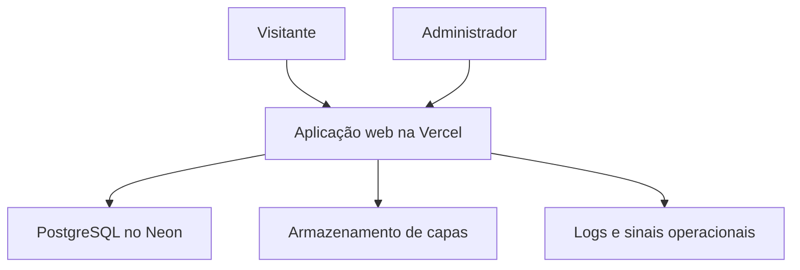

# Engenharia e Arquitetura — OPALIB

## 1. Objetivo

Este documento converte os requisitos de produto e experiência do OPALIB em forças de engenharia e em uma arquitetura implementável com baixa complexidade operacional.

Ele define:

- atributos de qualidade;
- contexto e fronteiras do sistema;
- modelo arquitetural;
- estratégia do repositório;
- módulos e responsabilidades;
- modelo conceitual de dados;
- fluxos técnicos críticos;
- decisões de segurança;
- necessidades de infraestrutura;
- critérios que a futura stack deverá atender.

Ele não escolhe framework, ORM, biblioteca de autenticação, biblioteca de UI ou ferramenta de testes. Essas escolhas pertencem à Visão do Tech Lead.

## 2. Contexto técnico

O OPALIB será um acervo acadêmico pessoal com duas superfícies:

- uma experiência pública, predominantemente de leitura;
- uma experiência administrativa, utilizada por um único autor.

O público poderá ler, pesquisar, curtir e comentar sem criar conta. Somente o administrador poderá criar, alterar, publicar, retirar ou excluir publicações e moderar comentários.

Decisões de plataforma já aprovadas:

- aplicação hospedada na Vercel;
- banco relacional PostgreSQL gerenciado pelo Neon;
- código e documentação versionados no GitHub;
- aplicação web responsiva;
- imagem de capa opcional;
- autoria em Markdown seguro;
- projeto mantido inicialmente por uma única pessoa.

## 3. Premissas de escala

### MVP

- volume baixo ou moderado de publicações;
- um único administrador;
- predominância de leitura sobre escrita;
- tráfego inicialmente baixo, com possibilidade de picos ocasionais por compartilhamento;
- comentários e curtidas em volume moderado;
- uma imagem de capa por publicação;
- nenhuma necessidade de tempo real;
- nenhuma necessidade de operação offline;
- nenhuma necessidade de processamento longo ou intensivo.

### Evolução esperada

- crescimento gradual do acervo;
- aumento da descoberta por mecanismos de busca;
- maior variedade de tags, categorias e referências;
- eventual necessidade de melhorar busca e moderação;
- possibilidade futura de integrações, sem compromisso no MVP.

A arquitetura deverá escalar verticalmente dentro dos serviços gerenciados antes de introduzir distribuição adicional.

## 4. Forças de engenharia

### Produto e operação

- **ENG-001** — A leitura pública deverá continuar disponível mesmo quando curtidas ou comentários apresentarem falha.
- **ENG-002** — O produto deverá ser operável e mantido por uma única pessoa.
- **ENG-003** — O MVP deverá evitar serviços, processos e deploys independentes sem necessidade comprovada.
- **ENG-004** — O acervo deverá possuir endereços permanentes e indexáveis.
- **ENG-005** — Alterações de estado editorial deverão ser explícitas, atômicas e rastreáveis.
- **ENG-006** — Publicações retiradas do ar não poderão permanecer acessíveis em caches públicos.

### Segurança e privacidade

- **ENG-007** — Nenhum cliente deverá possuir credenciais administrativas, segredo de banco ou token privilegiado.
- **ENG-008** — Toda autorização administrativa deverá ser verificada no servidor.
- **ENG-009** — Markdown, comentários, URLs e uploads deverão ser tratados como entradas não confiáveis.
- **ENG-010** — A administração deverá impedir cadastro público e suportar autenticação forte.
- **ENG-011** — Curtidas e comentários deverão possuir proteção contra repetição, spam e automação sem criar perfis públicos de visitantes.
- **ENG-012** — Dados técnicos utilizados contra abuso deverão ser mínimos, protegidos e retidos apenas pelo período necessário.
- **ENG-013** — Erros públicos não poderão revelar banco, stack, credenciais ou regras internas de autenticação.

### Dados e consistência

- **ENG-014** — O Markdown armazenado será a fonte canônica do conteúdo editorial.
- **ENG-015** — Prévia e publicação deverão utilizar a mesma política de interpretação e sanitização.
- **ENG-016** — Uma curtida confirmada não poderá ser desfeita pelo visitante nem duplicada em condições normais do mesmo navegador.
- **ENG-017** — A contagem de curtidas deverá permanecer consistente mesmo com requisições concorrentes.
- **ENG-018** — Comentários deverão ser persistidos antes de serem apresentados como publicados.
- **ENG-019** — Exclusões permanentes deverão respeitar confirmação, transação e trilha administrativa mínima.
- **ENG-020** — Alterações de esquema deverão ser reproduzíveis por migrations versionadas.

### Qualidade

- **ENG-021** — Regras de domínio críticas deverão ser testáveis sem depender da interface.
- **ENG-022** — Jornadas públicas e administrativas críticas deverão possuir testes automatizados em navegador.
- **ENG-023** — A solução deverá preservar acessibilidade, responsividade e segurança em cada mudança.
- **ENG-024** — Logs e sinais operacionais deverão permitir investigar falhas sem armazenar conteúdo sensível desnecessário.
- **ENG-025** — Deploy e rollback deverão ser reproduzíveis a partir do GitHub.

## 5. Atributos de qualidade

### Prioridade 1 — Integridade e segurança

Conteúdo público representa diretamente o autor. Impedir alteração não autorizada, publicação indevida e execução de conteúdo malicioso possui precedência sobre conveniência.

### Prioridade 2 — Manutenibilidade e simplicidade operacional

O sistema deverá possuir poucas unidades implantáveis, poucas dependências externas e fronteiras compreensíveis.

### Prioridade 3 — Leitura, acessibilidade e desempenho percebido

Conteúdo textual deverá carregar rapidamente, permanecer legível e não depender das interações dinâmicas.

### Prioridade 4 — Recuperação

Publicações, configurações e comentários deverão possuir estratégia documentada de backup, restauração e rollback.

### Prioridade 5 — Escalabilidade evolutiva

O produto deverá absorver crescimento normal utilizando recursos nativos da aplicação, Vercel e Neon antes de exigir novos serviços.

## 6. Decisão arquitetural principal

O OPALIB será uma **aplicação web full-stack modular, orientada a execução serverless e implantada como uma única unidade lógica**.

A interface, as rotas públicas, a administração e as operações de servidor permanecerão no mesmo projeto e ciclo de versão.

Internamente, responsabilidades serão separadas por módulos de domínio. Essa separação não criará microserviços nem deploys independentes.

### Motivos

- existe apenas uma superfície web;
- não há aplicativo nativo;
- a equipe inicial possui uma pessoa;
- o volume inicial não exige escala independente;
- transações de conteúdo e interação são simples;
- um deploy reduz custo operacional;
- fronteiras modulares preservam evolução futura;
- Vercel e Neon atendem ao perfil serverless já aprovado.

### Compromissos

- os módulos compartilharão processo e ciclo de deploy;
- falha estrutural da aplicação poderá afetar mais de uma área;
- disciplina de fronteiras será necessária para evitar acoplamento interno.

## 7. Visão do sistema



### Aplicação web

Responsável por:

- páginas públicas;
- páginas administrativas;
- renderização do conteúdo;
- endpoints e comandos de servidor;
- autenticação e autorização;
- validação;
- pesquisa;
- interações;
- integração com banco e mídia.

### PostgreSQL no Neon

Responsável por:

- publicações e metadados;
- taxonomia;
- comentários;
- curtidas e suas garantias de unicidade;
- sessões ou referências de identidade quando exigidas pela solução de autenticação;
- trilha administrativa mínima;
- migrations e constraints.

A aplicação deverá utilizar conexão adequada ao ambiente serverless e migrations deverão utilizar conexão direta, não agrupada.

### Armazenamento de capas

Imagens não serão armazenadas como binário no banco relacional.

Um armazenamento de objetos deverá guardar os arquivos, enquanto o banco manterá:

- identificador;
- endereço ou chave;
- tipo;
- tamanho;
- dimensões quando disponíveis;
- texto alternativo;
- datas;
- relação com a publicação.

O provedor concreto será escolhido na Visão do Tech Lead e na Infraestrutura.

## 8. Estratégia de repositório

Será utilizado um **repositório único simples**, e não um monorepo com múltiplas aplicações.

### Justificativa

- existe uma aplicação implantável;
- frontend e backend evoluem juntos;
- não existem equipes independentes;
- contratos internos não precisam ser publicados como pacotes;
- um único pipeline de CI é suficiente;
- a estrutura reduz cerimônia e manutenção.

### Estrutura lógica esperada

```text
/src
  /presentation
  /modules
    /publishing
    /taxonomy
    /discovery
    /interactions
    /identity
    /media
  /infrastructure
  /shared-kernel
/database
  /migrations
  /seeds
/tests
  /unit
  /integration
  /e2e
/public
/docs
/scripts
```

A Visão do Tech Lead poderá adaptar os nomes às convenções do framework escolhido, preservando as fronteiras sem criar camadas vazias.

### Regras de dependência

- apresentação pode chamar casos de uso dos módulos;
- módulos não dependem de componentes visuais;
- domínio não depende de HTTP, banco ou SDK de provedor;
- infraestrutura implementa contratos exigidos pelos módulos;
- módulos não acessam tabelas de outros módulos de forma informal;
- `shared-kernel` conterá apenas conceitos realmente compartilhados e estáveis;
- migrations pertencem ao repositório e são a fonte canônica do esquema.

## 9. Módulos

### 9.1. Publishing

Responsável por:

- criar e editar rascunhos;
- validar conteúdo publicável;
- publicar;
- atualizar conteúdo público;
- retirar do ar;
- excluir mediante política;
- controlar destaque;
- manter endereço permanente;
- expor conteúdo publicado.

Não será responsável por comentários, curtidas ou autenticação.

### 9.2. Taxonomy

Responsável por:

- áreas de conhecimento;
- categorias;
- tags;
- associações com publicações;
- regras de duplicidade e exclusão.

### 9.3. Discovery

Responsável por:

- página inicial;
- destaques e recentes;
- listagem do acervo;
- pesquisa;
- filtros;
- paginação;
- conteúdos relacionados;
- sitemap e superfícies de descoberta.

Utilizará dados publicados de Publishing e Taxonomy sem assumir autoridade sobre seu estado.

### 9.4. Interactions

Responsável por:

- registro irreversível de curtida;
- prevenção de duplicidade;
- contagem de curtidas;
- criação de comentário;
- estados visível e oculto;
- restauração e exclusão administrativa;
- controles de abuso.

### 9.5. Identity and Access

Responsável por:

- autenticação do administrador;
- sessão;
- encerramento de sessão;
- proteção de rotas e comandos;
- política de único administrador;
- trilha de ações sensíveis.

Cadastro público de administrador não existirá.

### 9.6. Media

Responsável por:

- autorização de upload;
- validação de tipo e tamanho;
- metadados;
- vínculo com publicação;
- substituição;
- remoção;
- prevenção e limpeza de arquivos órfãos.

## 10. Modelo conceitual de dados

### Entidades principais

#### Post

- identidade estável;
- título;
- slug permanente e único;
- resumo;
- Markdown canônico;
- tipo de conteúdo;
- status;
- destaque;
- datas editorial, original, de criação e atualização;
- curso e disciplina opcionais;
- metadados de compartilhamento;
- referência opcional à capa.

Estados permitidos:

- `draft`;
- `published`;
- `withdrawn`.

Transições deverão seguir o Documento 05.

#### KnowledgeArea

Representa Engenharia de Software, Educação Física e futuras áreas aprovadas.

Uma publicação poderá possuir mais de uma área.

#### Category e Tag

Possuem identidade, nome normalizado e slug único. Exclusão deverá respeitar associações existentes.

#### Reference

Representa referências bibliográficas ou links relacionados em ordem editorial.

#### CoverAsset

Representa metadados da imagem armazenada fora do banco e seu texto alternativo.

#### Like

Representa a confirmação de uma curtida para uma publicação e um identificador anônimo derivado do navegador.

O banco deverá garantir unicidade entre publicação e identificador anônimo.

#### Comment

Contém:

- publicação;
- nome informado ou `Anônimo`;
- texto simples;
- estado de moderação;
- data de criação;
- data e motivo técnico de moderação quando aplicável.

Estados:

- `visible`;
- `hidden`.

Exclusão permanente encerra a existência do conteúdo, mantendo somente evidência administrativa mínima se exigida pela política de auditoria.

#### AdminIdentity e AdminSession

Representam a identidade administrativa e suas sessões conforme a solução aprovada. Não haverá tabela ou fluxo de perfil público de visitante.

#### AuditEvent

Registra eventos administrativos relevantes, como publicação, retirada, exclusão e moderação, sem armazenar segredos ou conteúdo completo desnecessário.

## 11. Regras de consistência

- O status e as datas de publicação deverão mudar na mesma transação.
- Slugs deverão possuir unicidade no banco.
- Alterações de taxonomia deverão respeitar integridade referencial.
- Curtida deverá ser criada por operação atômica protegida por constraint de unicidade.
- A contagem exibida deverá vir de dado confirmado pelo servidor.
- Comentário deverá existir no banco antes do retorno de sucesso.
- Ocultação e restauração deverão preservar identidade e data originais.
- Exclusão de publicação deverá respeitar o estado `withdrawn`.
- A publicação e sua capa deverão ser relacionadas de forma consistente mesmo quando uma operação de armazenamento falhar.
- Cache nunca será fonte canônica.

## 12. Markdown e conteúdo seguro

O Markdown bruto será a fonte editorial canônica.

Um pipeline único e reutilizável deverá:

1. receber Markdown;
2. validar limites;
3. interpretar apenas recursos permitidos;
4. remover HTML arbitrário;
5. sanitizar a estrutura resultante;
6. validar URLs e protocolos;
7. produzir conteúdo seguro para prévia e publicação.

Prévia e página pública deverão utilizar a mesma implementação ou o mesmo núcleo de regras.

HTML renderizado poderá ser calculado e armazenado em cache, mas não substituirá o Markdown como fonte canônica.

Blocos de código deverão ser tratados como texto e nunca executados.

## 13. Pesquisa e descoberta

O MVP utilizará recursos do próprio PostgreSQL para pesquisa e filtragem.

Não será adotado mecanismo externo de busca.

A solução deverá suportar:

- título;
- resumo;
- conteúdo pesquisável;
- área;
- categoria;
- tag;
- tipo;
- período;
- ordenação;
- paginação estável.

Índices serão criados a partir dos padrões reais de consulta. Capacidades nativas de busca textual ou extensões compatíveis poderão ser escolhidas pelo Tech Lead.

Um mecanismo externo somente será avaliado se qualidade, volume ou latência deixarem de ser atendidos pelo PostgreSQL.

## 14. Curtidas anônimas

### Identificador

O navegador receberá um identificador aleatório e opaco, mantido em cookie protegido ou mecanismo equivalente aprovado.

O servidor derivará uma representação não reversível para persistência e não utilizará nome ou e-mail.

### Operação

1. receber a publicação e o contexto anônimo;
2. validar limites e existência da publicação pública;
3. tentar inserir a curtida;
4. utilizar a constraint de unicidade para resolver concorrência;
5. retornar contagem autoritativa e estado registrado ou já existente.

Não haverá endpoint de remoção pública.

Limpar dados do navegador ou trocar de navegador poderá permitir nova curtida. O requisito é uma curtida por navegador e publicação em condições normais, não identificação permanente da pessoa.

Endereço IP não será armazenado como identidade de quem curtiu. Poderá ser processado transitoriamente para limitação de abuso, com minimização e retenção definida na política de privacidade.

## 15. Comentários e moderação

Comentários serão texto simples e publicados imediatamente após validação e persistência.

O fluxo deverá incluir:

- limite de tamanho;
- normalização controlada;
- rejeição de HTML e scripts;
- rate limiting;
- detecção de padrões abusivos;
- mensagem segura de recusa;
- preservação do texto no cliente em falha recuperável.

Ocultar será uma atualização reversível. Restaurar reverte esse estado. Excluir será uma operação administrativa permanente e confirmada.

Controles antispam deverão ser compostos por camadas:

- limites de requisição na borda ou aplicação;
- validação no servidor;
- heurísticas simples e auditáveis;
- constraint e transação no banco;
- moderação administrativa.

Serviços externos de análise não serão requisito do MVP.

## 16. Autenticação e autorização

### Regras

- não haverá cadastro público;
- a identidade administrativa será provisionada por processo controlado;
- sessão utilizará cookie seguro, `HttpOnly` e política `SameSite` apropriada;
- credenciais serão verificadas somente no servidor;
- comandos administrativos exigirão sessão válida e autorização explícita;
- esconder botões não será considerado autorização;
- mensagens de login serão genéricas;
- tentativas repetidas serão limitadas;
- sessões poderão ser revogadas;
- autenticação multifator deverá ser habilitada em produção quando suportada pela solução selecionada;
- mudanças sensíveis deverão produzir evento de auditoria.

### Proteções

- CSRF ou mecanismo equivalente para comandos baseados em cookie;
- rotação ou renovação segura de sessão;
- expiração por inatividade e absoluta conforme risco;
- headers de segurança;
- proteção contra open redirect;
- separação entre dados públicos e administrativos;
- princípio de menor privilégio no banco e serviços.

## 17. Superfícies de servidor

As operações poderão ser materializadas como rotas HTTP, ações de servidor ou mecanismo equivalente escolhido pelo Tech Lead.

Independentemente da tecnologia, existirão contratos equivalentes a:

### Consultas públicas

- listar destaques e recentes;
- pesquisar e filtrar publicações;
- obter publicação por slug;
- listar comentários visíveis;
- obter contagem de curtidas;
- gerar sitemap e metadados públicos.

### Comandos públicos

- registrar curtida;
- publicar comentário.

### Comandos administrativos

- entrar e sair;
- criar e salvar rascunho;
- publicar, atualizar e retirar;
- excluir publicação;
- administrar taxonomia;
- solicitar upload e relacionar capa;
- ocultar, restaurar e excluir comentário;
- alterar destaque.

Contratos de entrada e saída deverão ser validados em runtime. O navegador nunca acessará o banco diretamente com credenciais privilegiadas.

## 18. Cache e renderização

### Conteúdo público

Páginas públicas poderão utilizar renderização no servidor, geração antecipada ou cache controlado, desde que:

- continuem indexáveis;
- não sirvam conteúdo retirado;
- sejam invalidadas após publicação, atualização ou retirada;
- não incluam dados administrativos;
- preservem URLs permanentes.

### Interações

Curtidas e comentários utilizarão dados dinâmicos e confirmação do servidor. Eles não deverão impedir cache do corpo editorial quando a stack permitir separação segura.

### Administração

Superfícies administrativas não deverão ser armazenadas em cache público.

## 19. Mídia

Uploads serão iniciados apenas por administrador autenticado.

O servidor deverá controlar:

- autorização;
- nomes e chaves geradas;
- tipos permitidos;
- tamanho máximo;
- dimensões quando aplicável;
- associação com publicação;
- texto alternativo;
- substituição e remoção.

Capas são conteúdo público e deverão ser entregues de forma otimizada e cacheável.

Arquivos não relacionados após falha deverão ser rastreados e removidos por processo simples de limpeza, sem exigir fila no MVP.

## 20. Resiliência e degradação

- Falha de imagem não deverá impedir leitura do texto.
- Falha de curtida ou comentário não deverá derrubar a publicação.
- Falha de pesquisa deverá preservar filtros.
- Falha de banco em operação administrativa não deverá produzir estado visual de sucesso.
- Retentativas automáticas somente serão usadas quando a operação for segura e idempotente.
- A aplicação deverá possuir páginas de erro controladas e resposta segura para indisponibilidade.

## 21. Observabilidade

O MVP deverá possuir:

- logs estruturados de erros de servidor;
- identificador de correlação por requisição quando aplicável;
- monitoramento de falhas de deploy e runtime;
- alertas para indisponibilidade e erros recorrentes;
- eventos administrativos relevantes;
- medição básica de desempenho público;
- visibilidade sobre falhas de banco e armazenamento.

Logs não deverão conter segredos, sessão, conteúdo integral de publicação ou comentário, nem identificadores desnecessários de visitantes.

Ferramentas concretas serão definidas na Visão do Tech Lead e na Infraestrutura.

## 22. Ambientes

Serão necessários:

- desenvolvimento local;
- preview por mudança relevante;
- produção.

Regras:

- preview não poderá escrever no banco de produção;
- segredos serão isolados por ambiente;
- migrations serão testadas fora de produção;
- dados pessoais ou comentários reais não deverão ser copiados indiscriminadamente;
- branches isoladas do Neon poderão ser utilizadas para desenvolvimento, teste e preview;
- produção utilizará conexão agrupada para tráfego normal e conexão direta para migrations;
- serviços beta não serão dependência obrigatória do MVP sem decisão explícita de risco.

## 23. Backup, restauração e retenção

A infraestrutura deverá definir:

- janela de recuperação compatível com o plano do Neon;
- procedimento de point-in-time restore ou mecanismo equivalente;
- backup lógico periódico quando necessário;
- teste de restauração;
- recuperação de imagens de capa;
- retenção de logs e eventos administrativos;
- tratamento de comentários excluídos;
- responsáveis e passos de incidente.

Backup somente será considerado confiável quando existir procedimento de restauração testado.

## 24. Segurança — ameaças e controles

| Ameaça                                | Controle arquitetural                                          |
| ------------------------------------- | -------------------------------------------------------------- |
| alteração de publicação por visitante | autorização obrigatória no servidor                            |
| roubo de sessão administrativa        | cookie protegido, expiração, revogação e MFA quando disponível |
| força bruta no login                  | rate limiting e mensagem genérica                              |
| XSS por Markdown                      | pipeline único com allowlist e sanitização                     |
| XSS por comentário                    | texto simples, escape de saída e rejeição de HTML              |
| upload malicioso                      | autorização, tipo, tamanho, chave gerada e validação           |
| SQL injection                         | consultas parametrizadas e validação de entrada                |
| duplicação de curtida                 | identificador opaco, constraint e operação atômica             |
| spam em comentários                   | limites em camadas e moderação                                 |
| CSRF administrativo                   | proteção explícita adequada ao mecanismo de sessão             |
| vazamento de segredo                  | execução server-side, secret scanning e variáveis protegidas   |
| conteúdo retirado em cache            | invalidação associada à transição de estado                    |
| enumeração de identidade              | erro de autenticação genérico                                  |
| abuso de endpoint                     | rate limiting, limites de payload e observabilidade            |

## 25. Alternativas arquiteturais avaliadas

| Alternativa                                  |      Simplicidade | Operação |                            Isolamento |                            Adequação ao MVP | Decisão          |
| -------------------------------------------- | ----------------: | -------: | ------------------------------------: | ------------------------------------------: | ---------------- |
| aplicação full-stack modular                 |              alta |     alta |                            suficiente |                                        alta | escolhida        |
| frontend e API em deploys separados          |             média |    média |                                  alta |                                       média | rejeitada no MVP |
| microserviços                                |             baixa |    baixa |                                  alta |                                       baixa | rejeitada        |
| conteúdo somente em arquivos Markdown no Git | alta para leitura |     alta | baixa para administração e interações |                                       baixa | rejeitada        |
| CMS externo                                  |             média |    média |                                 média | baixa diante do editor e moderação próprios | rejeitada        |
| busca externa dedicada                       |             baixa |    baixa |                                  alta |                     baixa no volume inicial | adiada           |

## 26. Decisões arquiteturais

### ADR-001 — Aplicação full-stack modular

**Status:** aceita.

**Decisão:** interface e operações de servidor serão entregues como uma única aplicação, organizada por módulos internos.

**Revisitar quando:** existir necessidade comprovada de escala, segurança, ownership ou deploy independente.

### ADR-002 — Repositório único simples

**Status:** aceita.

**Decisão:** não adotar monorepo ou polyrepo enquanto existir apenas uma aplicação implantável.

**Revisitar quando:** surgirem aplicações independentes ou bibliotecas com ciclo próprio.

### ADR-003 — Não adotar microserviços no MVP

**Status:** aceita.

**Motivos:** equipe de uma pessoa, baixo volume, transações simples e alto custo operacional relativo.

**Revisitar quando:** módulos exigirem escala ou deploy independentes e a evidência superar o custo.

### ADR-004 — PostgreSQL como fonte transacional

**Status:** aceita.

**Decisão:** conteúdo, taxonomia, interações e estado administrativo serão persistidos no PostgreSQL do Neon.

Cache e armazenamento de objetos não serão fonte canônica desses dados.

### ADR-005 — Markdown como fonte editorial

**Status:** aceita.

**Decisão:** armazenar Markdown original e aplicar um único pipeline seguro para prévia e publicação.

### ADR-006 — Imagens fora do banco relacional

**Status:** aceita.

**Decisão:** capas residirão em armazenamento de objetos; o banco manterá metadados e vínculo.

### ADR-007 — Busca nativa no PostgreSQL

**Status:** aceita para o MVP.

**Decisão:** não adicionar mecanismo externo antes de evidência de necessidade.

### ADR-008 — Sem fila, realtime ou worker dedicado

**Status:** aceita para o MVP.

**Decisão:** fluxos principais serão síncronos e curtos. Tarefas eventuais de manutenção usarão mecanismos simples aprovados posteriormente.

### ADR-009 — Interações anônimas com identificador opaco

**Status:** aceita.

**Decisão:** likes usarão identificador anônimo por navegador e constraint de unicidade. Comentários não criarão perfil.

### ADR-010 — Serviços beta não serão dependência central

**Status:** aceita.

**Decisão:** recursos em beta poderão ser avaliados, mas o núcleo do MVP utilizará capacidades estáveis ou possuirá alternativa simples.

## 27. Verificações arquiteturais

| Decisão                                | Verificação esperada                                        |
| -------------------------------------- | ----------------------------------------------------------- |
| domínio independente de interface      | regra de importação e testes unitários sem framework visual |
| cliente sem credenciais privilegiadas  | secret scanning e inspeção de variáveis públicas            |
| autorização administrativa no servidor | testes negativos de acesso e mutação                        |
| Markdown seguro                        | suíte de payloads maliciosos                                |
| curtida única                          | constraint, teste concorrente e teste de repetição          |
| comentário como texto simples          | testes de HTML, script e protocolos perigosos               |
| preview isolado de produção            | configuração e teste de ambiente                            |
| publicação retirada sem cache          | teste E2E de invalidação                                    |
| migrations reproduzíveis               | execução em banco isolado na CI                             |
| módulos com fronteiras                 | boundary check definido pela stack                          |

## 28. Necessidades para a Visão do Tech Lead

- **TL-NEED-001** — Stack compatível com Vercel e PostgreSQL no Neon.
- **TL-NEED-002** — Renderização indexável e cache controlado para conteúdo público.
- **TL-NEED-003** — Execução server-side para autenticação, mutações e segredos.
- **TL-NEED-004** — Type safety estrito e validação de runtime.
- **TL-NEED-005** — ORM ou camada de acesso com migrations versionadas e suporte PostgreSQL.
- **TL-NEED-006** — Conexão adequada a funções serverless e conexão direta para migrations.
- **TL-NEED-007** — Pipeline Markdown com allowlist e sanitização.
- **TL-NEED-008** — Autenticação sem cadastro público, sessão segura, revogação e MFA quando possível.
- **TL-NEED-009** — Upload de imagem para armazenamento de objetos com autorização no servidor.
- **TL-NEED-010** — Testes unitários, integração e E2E automatizados.
- **TL-NEED-011** — Verificação de acessibilidade e responsividade.
- **TL-NEED-012** — Invalidação de conteúdo público após transições editoriais.
- **TL-NEED-013** — Proteção distribuída contra abuso sem adicionar complexidade desproporcional.
- **TL-NEED-014** — Observabilidade compatível com baixo custo e privacidade.
- **TL-NEED-015** — Uma biblioteca canônica por responsabilidade, salvo justificativa.

## 29. Necessidades de infraestrutura

- **INF-NEED-001** — Projeto Vercel com produção e previews.
- **INF-NEED-002** — PostgreSQL gerenciado no Neon.
- **INF-NEED-003** — Separação segura de bancos ou branches por ambiente.
- **INF-NEED-004** — Conexões agrupada e direta conforme uso.
- **INF-NEED-005** — Armazenamento de objetos para capas públicas.
- **INF-NEED-006** — Gerenciamento de segredos por ambiente.
- **INF-NEED-007** — CI integrada ao GitHub.
- **INF-NEED-008** — domínio, TLS, headers e proteção de borda.
- **INF-NEED-009** — observabilidade de build, runtime e banco.
- **INF-NEED-010** — backup, point-in-time recovery e teste de restauração.
- **INF-NEED-011** — procedimento de migration e rollback.
- **INF-NEED-012** — controles de custo e limites de consumo.
- **INF-NEED-013** — ambientes local, preview e produção reproduzíveis.
- **INF-NEED-014** — retenção e acesso controlado a logs.

## 30. Fora da arquitetura do MVP

- aplicativo nativo;
- múltiplos autores;
- publicação por terceiros;
- microserviços;
- worker dedicado;
- mensageria;
- realtime;
- WebSocket;
- modo offline;
- Redis obrigatório;
- mecanismo externo de busca;
- CDN própria;
- data warehouse;
- analytics complexo;
- IA generativa;
- vetores e embeddings;
- versionamento editorial paralelo;
- múltiplas regiões ativas.

## 31. Critérios de aceite arquitetural

O Documento 07 será considerado materializado quando:

- existir uma única aplicação implantável com módulos internos claros;
- o cliente não acessar banco ou segredos privilegiados;
- toda mutação administrativa for autorizada no servidor;
- Markdown e comentários forem seguros por construção;
- curtidas forem atômicas e protegidas contra repetição normal;
- a pesquisa funcionar sem serviço externo;
- publicações retiradas deixarem de ser servidas por origem e cache;
- uploads forem autorizados e armazenados fora do banco;
- ambientes não compartilharem dados e segredos indevidamente;
- migrations e restauração forem verificáveis;
- testes cobrirem fronteiras críticas;
- a aplicação puder ser operada por uma pessoa;
- a stack futura conseguir atender todos os itens `TL-NEED`;
- a infraestrutura conseguir atender todos os itens `INF-NEED`.
